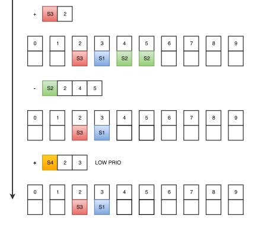
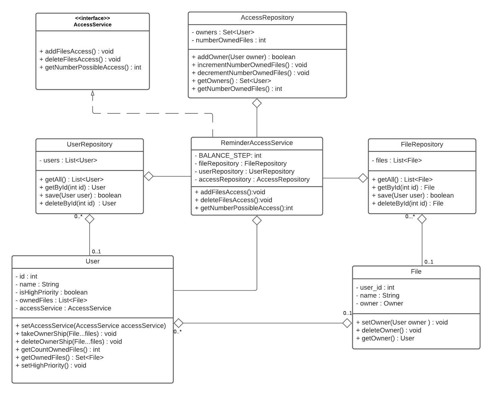

# java-ownership-task
## Задача коллективного владения  
### Содержание  
[Условие задачи](#условие-задачи)  
[Требования](#требования)  
[Визуальный комментарий](#визуальный-комментарий)  
[Решение](#решение)

### Условие задачи 
‌Имеется‌ ‌N‌ ‌объектов‌ ‌и‌ ‌M‌ ‌субъектов,‌ ‌M‌ ‌может‌ ‌быть‌ ‌как‌ ‌больше,‌ ‌равно,‌‌
так‌ ‌и‌ ‌меньше‌ ‌N.‌ ‌Каждый‌ ‌субъект‌ ‌может‌ быть‌ ‌способным‌‌ ‌владеть‌ ‌некоторым‌‌
подмножеством‌ ‌из‌ ‌N‌ ‌(например‌ ‌N1,‌ ‌N2,‌ ‌N3)‌ ‌-‌ ‌SN.‌ ‌Каждый‌ ‌субъект‌ ‌в‌ некоторый‌‌
момент‌‌ ‌времени‌ ‌может‌ владеть‌‌ ‌некоторыми‌ ‌объектами‌ ‌из‌ ‌своего‌ ‌подмножества‌ ‌SN.‌‌
В‌ ‌каждый‌ ‌момент‌ ‌времени‌ ‌одним‌ ‌объектом‌ ‌может‌ ‌владеть‌ ‌только‌ ‌один‌ ‌субъект.‌‌
Задача‌ ‌заключается‌ ‌в‌ ‌том,‌ ‌чтобы‌ ‌максимально‌ ‌справедливо‌ ‌распределять‌ ‌владение‌‌
объектами‌ ‌между‌ ‌субъектами‌ ‌в‌ ‌соответствии‌ ‌с требованиями.

### Требования
1. Субъекты‌ ‌могут‌ ‌добавляться‌ ‌и‌ ‌удаляться‌ ‌из‌ ‌системы‌ ‌по‌ ‌одному‌ ‌за‌ ‌одно‌‌
решение‌ ‌задачи‌ ‌распределения‌ ‌(то‌ ‌есть‌ ‌гарантируется‌ ‌что‌ ‌в‌ ‌процессе‌ ‌решения‌‌
задачи‌ ‌агенты‌ ‌не‌ ‌будут‌ ‌удаляться‌ ‌и‌ ‌добавляться)‌;
2.  Субъект‌ ‌может‌ ‌быть‌ ‌владельцем‌ ‌только‌ ‌тех‌ ‌объектов,‌ ‌которые‌ ‌находятся‌ ‌в‌‌
подмножестве‌ ‌его‌ ‌допустимых‌ ‌объектов;
3. Распределение‌ ‌должно‌ ‌быть‌ ‌справедливым‌ ‌и‌ ‌стремиться‌ ‌к‌ ‌равномерному‌‌
распределению‌ ‌среди‌ ‌субъектов‌;
4. Распределение‌ ‌должно‌ ‌быть‌ ‌устойчивым,‌ ‌то‌ ‌есть‌ ‌при‌ ‌добавлении‌ ‌или‌ ‌удалении‌‌
субъекта‌ ‌не‌ ‌должен‌ ‌происходить‌ ‌сброс‌ ‌состояния‌ ‌и‌ ‌полный‌ ‌перерасчет,‌ ‌а‌‌
должно‌ ‌производиться‌ ‌снятие‌ ‌владения‌ ‌и‌ ‌назначение‌ ‌владения‌ ‌в‌ ‌соответствии‌‌
с‌ ‌новой‌ ‌диспозицией;
5. Должна‌ ‌быть‌ ‌возможность‌ ‌для‌ ‌некоторого‌ ‌субъекта‌ ‌(при‌ ‌инициализации)‌ ‌задать‌‌
параметр,‌ ‌который‌ ‌будет‌ ‌позволять‌ ‌ему‌ ‌становиться‌ ‌владельцем‌ ‌только‌ ‌в‌ ‌том‌‌
случае,‌ ‌если‌ ‌нет‌ ‌других‌ ‌кандидатов‌ ‌(то‌ ‌есть‌ ‌субъект‌ ‌должен‌ ‌избегать‌‌
становиться‌ ‌владельцем);
6. Объект‌ ‌может‌ ‌находиться‌ ‌без‌ ‌владения‌ ‌кем-то‌ ‌только‌ ‌в‌ ‌том‌ ‌случае,‌ ‌если‌ ‌нет‌‌
субъекта,‌ ‌в‌ ‌чьем‌ ‌подмножестве‌ ‌допустимого‌ ‌владения‌ ‌присутствует‌ ‌данный‌‌
объект;
7. Если‌ ‌субъект‌ ‌имеет‌ ‌приоритет‌ ‌LOWPRIO,‌ ‌то‌ ‌он‌ ‌становится‌ ‌владельцем,‌ ‌только‌‌
в‌ ‌том‌ ‌случае,‌ ‌если‌ ‌нет‌ ‌владельца‌ ‌нормального‌ ‌приоритета‌ ‌и‌ ‌передает‌‌
владение‌ ‌при‌ ‌появлении‌ ‌владельца‌ ‌нормального‌ ‌приоритета.

### Визуальный комментарий
​
​
---
### Решение
#### Описание решения  
В своем решении в качестве примера субъекта и объекта, я использовал аналогию с Пользователями(субъекты) и Файлами(объекты).
В данном решении, чтобы получить равномерное распределение файлов среди пользователей, я использовал остаток от деления количества файлов на количество пользователей.  
Получилось три основных случая: 
1. Остаток от деления равен 0. В таком случае файлы в равном количестве распределятся среди пользователей.    
**Пример:** 16 файлов / 8 пользователей = 2 файла каждому пользователю.
2. Остаток от деления больше половины делителя. В таком случае первые пользователи получат по целому от деления + 1, а последние пользователи по целому от деления.  
**Пример:**  100 файлов / 51 пользователей = 1 целое (49 остаток) - 49 пользователей получат по 2 файла (1 целое + 1), оставшиеся по целому от деления, т.е. по 1.
49 пользователей по 2 файла + 2 пользователя по 1 файлу = 100 файлов и 51 пользователь.
3. Остаток от деления меньше половины делителя. В таком случае все пользователи будут получать по целому от деления, до тех пор пока не останется файлов = остатку от деления. Оставшиеся файлы достанутся первым потребовавшим пользователям.  
**Пример:** 100 файлов / 49 пользователей = 2 целое (2 остаток) - 49 пользователей получат по 2 файла, а когда останется 2 нераспределенных - их получат первые 2 запросивших.
Константа BALANCE_STEP отвечает за баланс распределения - один пользователь не может владеть более, чем остаток от деления + BALANCE_STEP.  
В данном примере пользователь не сможет владеть более чем 2 (остаток) + 1 (BALANCE_STEP) = 3 файлами.

#### Сложность
1. Расчет количества возможных владений для пользователя: O(1)
2. Установка прав на файл пользователем: O(1)
3. Удаление прав на файл пользователем: O(1)

#### UML диаграмма
​
#### Пример кода  
    // Создаем экземпляр класса, добавив в него репозитории с файлами и пользователями 
    ReminderAccessService accessService = new ReminderAccessService(fileRepository, userRepository);
    User user = userRepository.getById(0);

    // Получить количество файлов, которыми может владеть данный пользователь 
    accessService.getNumberPossibleAccess(user));

    // Получить право на файлы через метод пользователя
    user.takeOwnershipFiles(fileRepository.getById(0),fileRepository.getById(1));

    // Получить право на файлы через accessService
    accessService.addFilesAccess(user, fileRepository.getById(0),fileRepository.getById(1));

    // Удалить права на файлы через метод пользователя
    user.deleteFilesOwnership(fileRepository.getById(0));

    // Удалить права на файлы через через accessService
    accessService.deleteFilesAccess(user, fileRepository.getById(0),fileRepository.getById(1))

    // По умолчанию пользователи в Low Priority - не могут переписать право, если файл уже во владении
    // Чтобы пользователь мог перезаписывать права на уже занятые файлы, нужно выставить highPriority
    user.setHighPriority(true);
    